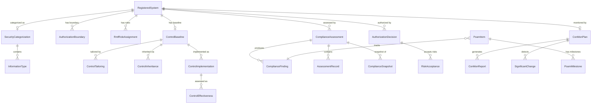

# Data Model: 015 — Persona-Driven RMF Workflows

**Date**: 2026-02-27 | **Plan**: [plan.md](plan.md) | **Research**: [research.md](research.md)

## Entity Relationship Diagram



## New Entities

### RegisteredSystem (Phase 1)

The anchor entity for all RMF data. Every tool in the copilot operates within the context of a registered system.

| Field | Type | Constraints | Description |
|-------|------|-------------|-------------|
| `Id` | `string` | PK, GUID | Unique identifier |
| `Name` | `string` | Required, MaxLength(200) | System name (e.g., "ACME Portal") |
| `Acronym` | `string` | MaxLength(20) | System acronym (e.g., "ACME") |
| `SystemType` | `SystemType` enum | Required | MajorApplication, Enclave, PlatformIt (per DoDI 8510.01) |
| `Description` | `string?` | MaxLength(2000) | System description |
| `MissionCriticality` | `MissionCriticality` enum | Required | MissionCritical, MissionEssential, MissionSupport |
| `IsNationalSecuritySystem` | `bool` | Default: false | NSS designation (affects IL mapping) |
| `ClassifiedDesignation` | `string?` | MaxLength(20) | "Secret", "TopSecret", null (for IL6 designation) |
| `HostingEnvironment` | `string` | Required, MaxLength(100) | "Azure Government", "Azure Commercial", "On-Premises", "Hybrid" |
| `CurrentRmfStep` | `RmfStep` enum | Required, Default: Prepare | Current lifecycle position |
| `RmfStepUpdatedAt` | `DateTime` | UTC | When step last changed |
| `CreatedBy` | `string` | Required, MaxLength(200) | User who registered the system |
| `CreatedAt` | `DateTime` | UTC | Registration timestamp |
| `ModifiedAt` | `DateTime?` | UTC | Last modification |
| `IsActive` | `bool` | Default: true | Soft delete |

**Owned entity** — `AzureEnvironmentProfile`:

| Field | Type | Description |
|-------|------|-------------|
| `CloudEnvironment` | `AzureCloudEnvironment` enum | Commercial, Government, GovernmentAirGappedIl5, GovernmentAirGappedIl6 |
| `ArmEndpoint` | `string` | ARM management endpoint URL |
| `AuthenticationEndpoint` | `string` | Entra ID / auth endpoint |
| `DefenderEndpoint` | `string?` | Defender for Cloud endpoint |
| `PolicyEndpoint` | `string?` | Policy service endpoint |
| `ProxyUrl` | `string?` | Proxy for air-gapped egress |
| `SubscriptionIds` | `List<string>` | Azure subscription IDs within boundary |

### SecurityCategorization (Phase 1)

| Field | Type | Constraints | Description |
|-------|------|-------------|-------------|
| `Id` | `string` | PK, GUID | |
| `RegisteredSystemId` | `string` | FK → RegisteredSystem, Unique | One categorization per system |
| `IsNationalSecuritySystem` | `bool` | | NSS flag for IL derivation |
| `Justification` | `string?` | MaxLength(4000) | Categorization rationale |
| `CategorizedBy` | `string` | Required | User who performed categorization |
| `CategorizedAt` | `DateTime` | UTC | |
| `ModifiedAt` | `DateTime?` | UTC | |

**Computed properties** (not stored):
- `ConfidentialityImpact` → `ImpactValue` (max across InformationTypes)
- `IntegrityImpact` → `ImpactValue`
- `AvailabilityImpact` → `ImpactValue`
- `OverallCategorization` → `ImpactValue` (max of C/I/A)
- `DoDImpactLevel` → `string` (IL2/IL4/IL5; IL6 via ClassifiedDesignation)
- `NistBaseline` → `string` (Low/Moderate/High)
- `FormalNotation` → `string` (FIPS 199 format)

### InformationType (Phase 1)

| Field | Type | Constraints | Description |
|-------|------|-------------|-------------|
| `Id` | `string` | PK, GUID | |
| `SecurityCategorizationId` | `string` | FK → SecurityCategorization | |
| `Sp80060Id` | `string` | Required, MaxLength(20) | SP 800-60 identifier (e.g., "D.1.1") |
| `Name` | `string` | Required, MaxLength(200) | Information type name |
| `Category` | `string` | MaxLength(200) | SP 800-60 category |
| `ConfidentialityImpact` | `ImpactValue` | Required | |
| `IntegrityImpact` | `ImpactValue` | Required | |
| `AvailabilityImpact` | `ImpactValue` | Required | |
| `UsesProvisionalImpactLevels` | `bool` | Default: true | Whether values match SP 800-60 defaults |
| `AdjustmentJustification` | `string?` | MaxLength(2000) | Required if UsesProvisional = false |

### AuthorizationBoundary (Phase 1)

| Field | Type | Constraints | Description |
|-------|------|-------------|-------------|
| `Id` | `string` | PK, GUID | |
| `RegisteredSystemId` | `string` | FK → RegisteredSystem | |
| `ResourceId` | `string` | Required, MaxLength(500) | Azure resource ID |
| `ResourceType` | `string` | Required, MaxLength(200) | Azure resource type |
| `ResourceName` | `string` | MaxLength(200) | Display name |
| `IsInBoundary` | `bool` | Required | true = in scope, false = excluded |
| `ExclusionRationale` | `string?` | MaxLength(1000) | Required if IsInBoundary = false |
| `InheritanceProvider` | `string?` | MaxLength(200) | CSP/common control provider if inherited |
| `AddedAt` | `DateTime` | UTC | |
| `AddedBy` | `string` | Required | |

### RmfRoleAssignment (Phase 1)

| Field | Type | Constraints | Description |
|-------|------|-------------|-------------|
| `Id` | `string` | PK, GUID | |
| `RegisteredSystemId` | `string` | FK → RegisteredSystem | |
| `RmfRole` | `RmfRole` enum | Required | AO, ISSM, ISSO, SCA, SystemOwner |
| `UserId` | `string` | Required, MaxLength(200) | Assigned user identity |
| `UserDisplayName` | `string` | MaxLength(200) | Display name |
| `AssignedAt` | `DateTime` | UTC | |
| `AssignedBy` | `string` | Required | |
| `IsActive` | `bool` | Default: true | |

### ControlBaseline (Phase 1)

| Field | Type | Constraints | Description |
|-------|------|-------------|-------------|
| `Id` | `string` | PK, GUID | |
| `RegisteredSystemId` | `string` | FK → RegisteredSystem, Unique | One baseline per system |
| `BaselineLevel` | `string` | Required, MaxLength(20) | "Low", "Moderate", "High" |
| `OverlayApplied` | `string?` | MaxLength(100) | "CNSSI 1253 IL4", "CNSSI 1253 IL5", etc. |
| `TotalControls` | `int` | | Total controls after baseline + overlay |
| `CustomerControls` | `int` | | Controls marked as customer responsibility |
| `InheritedControls` | `int` | | Controls marked as inherited |
| `SharedControls` | `int` | | Controls marked as shared |
| `TailoredOutControls` | `int` | | Controls removed via tailoring |
| `TailoredInControls` | `int` | | Controls added via tailoring |
| `ControlIds` | `List<string>` | JSON column | Full list of applicable control IDs |
| `CreatedAt` | `DateTime` | UTC | |
| `CreatedBy` | `string` | Required | |
| `ModifiedAt` | `DateTime?` | UTC | |

### ControlTailoring (Phase 1)

| Field | Type | Constraints | Description |
|-------|------|-------------|-------------|
| `Id` | `string` | PK, GUID | |
| `ControlBaselineId` | `string` | FK → ControlBaseline | |
| `ControlId` | `string` | Required, MaxLength(20) | NIST control ID |
| `Action` | `TailoringAction` enum | Required | Added, Removed |
| `Rationale` | `string` | Required, MaxLength(2000) | Documented justification |
| `IsOverlayRequired` | `bool` | | Whether overlay mandates this control |
| `TailoredBy` | `string` | Required | |
| `TailoredAt` | `DateTime` | UTC | |

### ControlInheritance (Phase 1)

| Field | Type | Constraints | Description |
|-------|------|-------------|-------------|
| `Id` | `string` | PK, GUID | |
| `ControlBaselineId` | `string` | FK → ControlBaseline | |
| `ControlId` | `string` | Required, MaxLength(20) | |
| `InheritanceType` | `InheritanceType` enum | Required | Inherited, Shared, Customer |
| `Provider` | `string?` | MaxLength(200) | CSP name if Inherited/Shared |
| `CustomerResponsibility` | `string?` | MaxLength(2000) | What the customer must do if Shared |
| `SetBy` | `string` | Required | |
| `SetAt` | `DateTime` | UTC | |

### ControlImplementation (Phase 2)

| Field | Type | Constraints | Description |
|-------|------|-------------|-------------|
| `Id` | `string` | PK, GUID | |
| `RegisteredSystemId` | `string` | FK → RegisteredSystem | |
| `ControlId` | `string` | Required, MaxLength(20) | NIST control ID |
| `ImplementationStatus` | `ImplementationStatus` enum | Required | Implemented, PartiallyImplemented, Planned, NotApplicable |
| `Narrative` | `string?` | MaxLength(8000) | Implementation description for SSP |
| `IsAutoPopulated` | `bool` | Default: false | True for inherited-control auto-narratives |
| `AiSuggested` | `bool` | Default: false | True if AI generated the draft |
| `ReviewedBy` | `string?` | | User who reviewed/approved the narrative |
| `ReviewedAt` | `DateTime?` | UTC | |
| `AuthoredBy` | `string` | Required | |
| `AuthoredAt` | `DateTime` | UTC | |
| `ModifiedAt` | `DateTime?` | UTC | |

**Unique constraint**: (`RegisteredSystemId`, `ControlId`)

### ControlEffectiveness (Phase 3)

| Field | Type | Constraints | Description |
|-------|------|-------------|-------------|
| `Id` | `string` | PK, GUID | |
| `AssessmentId` | `string` | FK → ComplianceAssessment | |
| `RegisteredSystemId` | `string` | FK → RegisteredSystem | |
| `ControlId` | `string` | Required, MaxLength(20) | |
| `Determination` | `EffectivenessDetermination` enum | Required | Satisfied, OtherThanSatisfied |
| `AssessmentMethod` | `string` | MaxLength(50) | "Test", "Interview", "Examine" |
| `EvidenceIds` | `List<string>` | JSON column | Links to ComplianceEvidence records |
| `Notes` | `string?` | MaxLength(4000) | Assessor notes |
| `CatSeverity` | `CatSeverity?` enum | | CAT I, CAT II, CAT III (if OtherThanSatisfied) |
| `AssessorId` | `string` | Required | SCA who made determination |
| `AssessedAt` | `DateTime` | UTC | |

### AssessmentRecord (Phase 3)

Aggregate per-system assessment summary linked to a ComplianceAssessment. Referenced by authorization tools and the dashboard.

| Field | Type | Constraints | Description |
|-------|------|-------------|-------------|
| `Id` | `string` | PK, GUID | |
| `RegisteredSystemId` | `string` | FK → RegisteredSystem | |
| `ComplianceAssessmentId` | `string` | FK → ComplianceAssessment | |
| `ControlsAssessed` | `int` | Required | Total controls assessed |
| `ControlsSatisfied` | `int` | Required | Controls determined Satisfied |
| `ControlsOtherThanSatisfied` | `int` | Required | Controls determined OtherThanSatisfied |
| `ControlsNotApplicable` | `int` | Default: 0 | Controls excluded from scoring |
| `ComplianceScore` | `double` | Computed | See [Compliance Score Formula](#compliance-score-formula) |
| `OverallDetermination` | `string` | MaxLength(50) | "Authorized", "Denied", "Conditional" |
| `AssessorId` | `string` | Required | SCA user ID |
| `AssessorName` | `string` | Required, MaxLength(200) | SCA display name |
| `AssessedAt` | `DateTime` | UTC | Assessment completion date |
| `Notes` | `string?` | MaxLength(4000) | Assessment summary notes |

**Unique constraint**: (`RegisteredSystemId`, `ComplianceAssessmentId`)

### AuthorizationDecision (Phase 3)

| Field | Type | Constraints | Description |
|-------|------|-------------|-------------|
| `Id` | `string` | PK, GUID | |
| `RegisteredSystemId` | `string` | FK → RegisteredSystem | |
| `DecisionType` | `AuthorizationDecisionType` enum | Required | ATO, ATOwC, IATT, DATO |
| `DecisionDate` | `DateTime` | UTC | |
| `ExpirationDate` | `DateTime?` | UTC | null for DATO |
| `TermsAndConditions` | `string?` | MaxLength(8000) | |
| `ResidualRiskLevel` | `ComplianceRiskLevel` enum | Required | |
| `ResidualRiskJustification` | `string?` | MaxLength(4000) | |
| `ComplianceScoreAtDecision` | `double` | | Score at time of authorization |
| `FindingsAtDecision` | `string` | JSON | `{ catI: n, catII: n, catIII: n }` |
| `IssuedBy` | `string` | Required | AO user ID |
| `IssuedByName` | `string` | Required | AO display name |
| `IsActive` | `bool` | Default: true | false when superseded or expired |
| `SupersededById` | `string?` | FK → self | Reference to replacement decision |

**RBAC**: Requires `Compliance.AuthorizingOfficial` role.

**Retention Policy**: AuthorizationDecision records MUST be retained for the full system lifecycle plus 3 years after decommission. Records are never hard-deleted; use `IsActive = false` and `SupersededById` to indicate supersession. Audit trail entries for authorization events are immutable.

### RiskAcceptance (Phase 3)

| Field | Type | Constraints | Description |
|-------|------|-------------|-------------|
| `Id` | `string` | PK, GUID | |
| `AuthorizationDecisionId` | `string` | FK → AuthorizationDecision | |
| `FindingId` | `string` | FK → ComplianceFinding | |
| `ControlId` | `string` | Required, MaxLength(20) | |
| `CatSeverity` | `CatSeverity` enum | Required | |
| `Justification` | `string` | Required, MaxLength(4000) | |
| `CompensatingControl` | `string?` | MaxLength(2000) | Compensating measure description |
| `ExpirationDate` | `DateTime` | UTC | Auto-revert on expiry |
| `AcceptedBy` | `string` | Required | AO user ID |
| `AcceptedAt` | `DateTime` | UTC | |
| `IsActive` | `bool` | Default: true | false when expired or revoked |
| `RevokedAt` | `DateTime?` | UTC | |
| `RevokedBy` | `string?` | |
| `RevocationReason` | `string?` | MaxLength(1000) | |

### PoamItem (Phase 3 — enrichment of existing Kanban + POA&M)

| Field | Type | Constraints | Description |
|-------|------|-------------|-------------|
| `Id` | `string` | PK, GUID | |
| `RegisteredSystemId` | `string` | FK → RegisteredSystem | |
| `FindingId` | `string?` | FK → ComplianceFinding | |
| `RemediationTaskId` | `string?` | FK → RemediationTask | Links to Kanban |
| `Weakness` | `string` | Required, MaxLength(2000) | |
| `WeaknessSource` | `string` | Required, MaxLength(100) | "ACAS", "STIG", "SCA Assessment", "Manual" |
| `SecurityControlNumber` | `string` | Required, MaxLength(20) | NIST control ID |
| `CatSeverity` | `CatSeverity` enum | Required | |
| `PointOfContact` | `string` | Required, MaxLength(200) | |
| `PocEmail` | `string?` | MaxLength(200) | |
| `ResourcesRequired` | `string?` | MaxLength(1000) | |
| `CostEstimate` | `decimal?` | | Dollar amount |
| `ScheduledCompletionDate` | `DateTime` | UTC | Target fix date |
| `ActualCompletionDate` | `DateTime?` | UTC | |
| `Status` | `PoamStatus` enum | Required | Ongoing, Completed, Delayed, RiskAccepted |
| `Comments` | `string?` | MaxLength(4000) | |
| `CreatedAt` | `DateTime` | UTC | |
| `ModifiedAt` | `DateTime?` | UTC | |

### PoamMilestone (Phase 3)

| Field | Type | Constraints | Description |
|-------|------|-------------|-------------|
| `Id` | `string` | PK, GUID | |
| `PoamItemId` | `string` | FK → PoamItem | |
| `Description` | `string` | Required, MaxLength(1000) | Milestone description |
| `TargetDate` | `DateTime` | UTC | Due date |
| `CompletedDate` | `DateTime?` | UTC | |
| `IsOverdue` | `bool` | Computed | TargetDate < DateTime.UtcNow && CompletedDate == null |
| `Sequence` | `int` | Required | Order within POA&M item |

### ConMonPlan (Phase 4)

| Field | Type | Constraints | Description |
|-------|------|-------------|-------------|
| `Id` | `string` | PK, GUID | |
| `RegisteredSystemId` | `string` | FK → RegisteredSystem, Unique | |
| `AssessmentFrequency` | `string` | Required, MaxLength(50) | "Monthly", "Quarterly", "Annually" |
| `AnnualReviewDate` | `DateTime` | UTC | Anniversary date for annual review |
| `ReportDistribution` | `List<string>` | JSON column | Users/roles who receive reports |
| `SignificantChangeTriggers` | `List<string>` | JSON column | What constitutes significant change |
| `CreatedBy` | `string` | Required | |
| `CreatedAt` | `DateTime` | UTC | |
| `ModifiedAt` | `DateTime?` | UTC | |

### ConMonReport (Phase 4)

| Field | Type | Constraints | Description |
|-------|------|-------------|-------------|
| `Id` | `string` | PK, GUID | |
| `ConMonPlanId` | `string` | FK → ConMonPlan | |
| `RegisteredSystemId` | `string` | FK → RegisteredSystem | |
| `ReportPeriod` | `string` | Required, MaxLength(50) | "2026-02", "2026-Q1" |
| `ReportType` | `string` | Required, MaxLength(20) | "Monthly", "Quarterly", "Annual" |
| `ComplianceScore` | `double` | | Current score |
| `AuthorizedBaselineScore` | `double?` | | Score at authorization (for delta) |
| `NewFindings` | `int` | | Findings opened this period |
| `ResolvedFindings` | `int` | | Findings closed this period |
| `OpenPoamItems` | `int` | | Current open POA&M count |
| `OverduePoamItems` | `int` | | Overdue POA&M count |
| `ReportContent` | `string` | MaxLength(50000) | Generated Markdown content |
| `GeneratedAt` | `DateTime` | UTC | |
| `GeneratedBy` | `string` | Required | |

### SignificantChange (Phase 4)

| Field | Type | Constraints | Description |
|-------|------|-------------|-------------|
| `Id` | `string` | PK, GUID | |
| `RegisteredSystemId` | `string` | FK → RegisteredSystem | |
| `ChangeType` | `string` | Required, MaxLength(100) | "New Interconnection", "Major Upgrade", etc. |
| `Description` | `string` | Required, MaxLength(4000) | |
| `DetectedAt` | `DateTime` | UTC | |
| `DetectedBy` | `string` | Required | "System" or user ID |
| `RequiresReauthorization` | `bool` | | |
| `ReauthorizationTriggered` | `bool` | Default: false | |
| `ReviewedBy` | `string?` | | ISSM who reviewed |
| `ReviewedAt` | `DateTime?` | UTC | |
| `Disposition` | `string?` | MaxLength(2000) | Review outcome |

## Compliance Score Formula

All `ComplianceScore` fields across entities use a consistent formula:

$$
\text{ComplianceScore} = \frac{\text{ControlsSatisfied}}{\text{ControlsAssessed} - \text{ControlsNotApplicable}} \times 100
$$

- **Inherited controls** are counted as Satisfied by default (unless overridden by the SCA)
- **N/A controls** are excluded from the denominator
- **Score = 0** when all assessed controls are N/A (division guard)
- Score is persisted as a `double` rounded to 2 decimal places
- ConMonReport.`ComplianceScore` and AuthorizationDecision.`ComplianceScoreAtDecision` use this same formula, computed at their respective point-in-time

## New Enums

```csharp
public enum RmfStep { Prepare, Categorize, Select, Implement, Assess, Authorize, Monitor }
public enum SystemType { MajorApplication, Enclave, PlatformIt }
public enum MissionCriticality { MissionCritical, MissionEssential, MissionSupport }
public enum AzureCloudEnvironment { Commercial, Government, GovernmentAirGappedIl5, GovernmentAirGappedIl6 }
public enum ImpactValue { Low = 0, Moderate = 1, High = 2 }
public enum RmfRole { AuthorizingOfficial, Issm, Isso, Sca, SystemOwner }
public enum TailoringAction { Added, Removed }
public enum InheritanceType { Inherited, Shared, Customer }
public enum ImplementationStatus { Implemented, PartiallyImplemented, Planned, NotApplicable }
public enum EffectivenessDetermination { Satisfied, OtherThanSatisfied }
public enum CatSeverity { CatI, CatII, CatIII }
public enum AuthorizationDecisionType { Ato, AtoWithConditions, Iatt, Dato }
public enum PoamStatus { Ongoing, Completed, Delayed, RiskAccepted }
```

## Reference Data Files (not EF Core)

| File | Format | Entries | Description |
|------|--------|---------|-------------|
| `cnssi-1253-overlays.json` | JSON | ~450 | CNSSI 1253 control overlays by C/I/A and IL |
| `sp800-60-information-types.json` | JSON | ~180 | SP 800-60 Vol 2 info type taxonomy |
| `nist-800-53-baselines.json` | JSON | 3 lists | Low/Moderate/High baseline control ID lists |
| `cci-nist-mapping.json` | JSON | ~7,575 | CCI → NIST 800-53 control mapping |

## Existing Entities Modified

| Entity | Changes |
|--------|---------|
| `ComplianceAssessment` | Add optional `RegisteredSystemId` FK (nullable for backward compat) |
| `ComplianceFinding` | Add `CatSeverity?` field |
| `ComplianceSnapshot` | Add `IntegrityHash` (SHA-256), `IsImmutable` flag |
| `ComplianceEvidence` | Add `CollectorIdentity`, `CollectionMethod`, `IntegrityVerifiedAt` |
| `RemediationTask` | Add optional `PoamItemId` FK |
| `StigControl` | Add 8 XCCDF fields (see research.md R4) |
