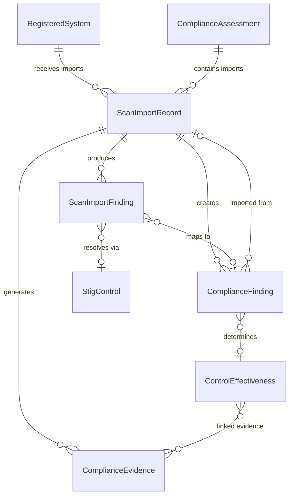

# Data Model: 017 — SCAP/STIG Viewer Import

**Date**: 2026-03-01 | **Plan**: [plan.md](plan.md) | **Spec**: [spec.md](spec.md)

## Entity Relationship Diagram



## New Entities

### ScanImportRecord (Phase 1)

Tracks each file import operation. One record per imported file.

| Field | Type | Constraints | Description |
|-------|------|-------------|-------------|
| `Id` | `string` | PK, GUID | Unique identifier |
| `RegisteredSystemId` | `string` | FK → RegisteredSystem, Required | System this import belongs to |
| `AssessmentId` | `string` | FK → ComplianceAssessment, Required | Assessment context for findings |
| `ImportType` | `ScanImportType` enum | Required | `Ckl` \| `Xccdf` |
| `FileName` | `string` | Required, MaxLength(500) | Original file name |
| `FileHash` | `string` | Required, MaxLength(128) | SHA-256 hash of raw file content |
| `FileSizeBytes` | `long` | Required | File size before base64 encoding |
| `BenchmarkId` | `string?` | MaxLength(200) | STIG benchmark ID (e.g., `Windows_Server_2022_STIG`) |
| `BenchmarkVersion` | `string?` | MaxLength(50) | STIG release version |
| `BenchmarkTitle` | `string?` | MaxLength(500) | STIG benchmark display title |
| `TargetHostName` | `string?` | MaxLength(200) | Target system hostname from scan |
| `TargetIpAddress` | `string?` | MaxLength(50) | Target IP address |
| `ScanTimestamp` | `DateTime?` | UTC | When the scan was performed. XCCDF: from `start-time` attribute. CKL: `null` (CKL format has no scan timestamp; STIG_INFO `releaseinfo` is the benchmark release date, not the scan date). |
| `TotalEntries` | `int` | Required | Total rules/VULNs in the file |
| `OpenCount` | `int` | | Findings with status Open/Fail |
| `PassCount` | `int` | | Findings with status NotAFinding/Pass |
| `NotApplicableCount` | `int` | | Findings with status Not_Applicable |
| `NotReviewedCount` | `int` | | Findings not evaluated (CKL `Not_Reviewed` / XCCDF `notchecked`) |
| `ErrorCount` | `int` | | XCCDF error/unknown results |
| `SkippedCount` | `int` | | Entries skipped due to conflict resolution |
| `UnmatchedCount` | `int` | | STIG rules not found in curated library |
| `FindingsCreated` | `int` | | New `ComplianceFinding` records created |
| `FindingsUpdated` | `int` | | Existing findings updated (overwrite/merge) |
| `EffectivenessRecordsCreated` | `int` | | New `ControlEffectiveness` records created |
| `EffectivenessRecordsUpdated` | `int` | | Existing effectiveness records updated |
| `NistControlsAffected` | `int` | | Unique NIST controls touched by this import |
| `ConflictResolution` | `ImportConflictResolution` enum | Required | `Skip` \| `Overwrite` \| `Merge` |
| `IsDryRun` | `bool` | Default: false | Whether this was a preview-only import |
| `XccdfScore` | `decimal?` | | XCCDF compliance score (if XCCDF import) |
| `ImportStatus` | `ScanImportStatus` enum | Required | `Completed` \| `CompletedWithWarnings` \| `Failed` |
| `ErrorMessage` | `string?` | MaxLength(4000) | Error details if import failed |
| `Warnings` | `List<string>` | JSON column | Non-fatal warnings (unmatched rules, baseline mismatches) |
| `ImportedBy` | `string` | Required, MaxLength(200) | User who performed the import |
| `ImportedAt` | `DateTime` | UTC | When the import was performed |

**Unique constraint**: None — same file can be re-imported (conflict resolution handles duplicates).

### ScanImportFinding (Phase 1)

Per-finding audit trail for each import. Links the raw parsed data to the resulting `ComplianceFinding`.

| Field | Type | Constraints | Description |
|-------|------|-------------|-------------|
| `Id` | `string` | PK, GUID | Unique identifier |
| `ScanImportRecordId` | `string` | FK → ScanImportRecord, Required | Parent import record |
| `VulnId` | `string` | Required, MaxLength(20) | STIG Vulnerability ID (e.g., `V-254239`) |
| `RuleId` | `string?` | MaxLength(100) | STIG Rule ID (e.g., `SV-254239r849090_rule`) |
| `StigVersion` | `string?` | MaxLength(50) | Rule version (e.g., `WN22-AU-000010`) |
| `RawStatus` | `string` | Required, MaxLength(50) | Original CKL STATUS or XCCDF result value |
| `RawSeverity` | `string` | Required, MaxLength(20) | Original severity text (`high`/`medium`/`low`) |
| `MappedSeverity` | `CatSeverity?` | | Resolved CAT severity |
| `FindingDetails` | `string?` | MaxLength(8000) | CKL FINDING_DETAILS or XCCDF message |
| `Comments` | `string?` | MaxLength(8000) | CKL COMMENTS field |
| `SeverityOverride` | `string?` | MaxLength(20) | CKL SEVERITY_OVERRIDE |
| `SeverityJustification` | `string?` | MaxLength(4000) | CKL SEVERITY_JUSTIFICATION |
| `ResolvedStigControlId` | `string?` | MaxLength(20) | Matched `StigControl.StigId` (null if unmatched) |
| `ResolvedNistControlIds` | `List<string>` | JSON column | NIST 800-53 control IDs resolved via CCI chain |
| `ResolvedCciRefs` | `List<string>` | JSON column | CCI references from the CKL/XCCDF entry |
| `ImportAction` | `ImportFindingAction` enum | Required | `Created` \| `Updated` \| `Skipped` \| `Unmatched` \| `NotApplicable` \| `NotReviewed` |
| `ComplianceFindingId` | `string?` | FK → ComplianceFinding (nullable) | Created/updated finding (null if skipped/unmatched) |

## Modified Entities

### ComplianceFinding — [ComplianceModels.cs](src/Ato.Copilot.Core/Models/Compliance/ComplianceModels.cs)

| Field | Change | Details |
|-------|--------|---------|
| `ImportRecordId` | **ADD** | Nullable FK → `ScanImportRecord`. Set when finding was created/updated via import. |

### ComplianceEvidence — [ComplianceModels.cs](src/Ato.Copilot.Core/Models/Compliance/ComplianceModels.cs)

No schema change — uses existing fields:
- `EvidenceType`: new values `"StigChecklist"` and `"ScapResult"` (string field, no enum change needed)
- `CollectionMethod`: `"Automated"` for XCCDF, `"Manual"` for CKL
- `EvidenceCategory`: `EvidenceCategory.Configuration`

## New Enums

### ScanImportType

```csharp
public enum ScanImportType
{
    Ckl,    // DISA STIG Viewer checklist
    Xccdf   // SCAP Compliance Checker XCCDF results
}
```

### ScanImportStatus

```csharp
public enum ScanImportStatus
{
    Completed,              // All entries processed successfully
    CompletedWithWarnings,  // Processed but with unmatched rules or baseline mismatches
    Failed                  // Fatal error (malformed XML, system not found, etc.)
}
```

### ImportConflictResolution

```csharp
public enum ImportConflictResolution
{
    Skip,       // Keep existing findings, skip duplicates
    Overwrite,  // Replace existing findings with imported data
    Merge       // Keep more-recent data, append details
}
```

### ImportFindingAction

```csharp
public enum ImportFindingAction
{
    Created,        // New ComplianceFinding created
    Updated,        // Existing finding updated (overwrite/merge)
    Skipped,        // Duplicate skipped (skip resolution)
    Unmatched,      // STIG rule not in curated library
    NotApplicable,  // CKL Not_Applicable / XCCDF notapplicable
    NotReviewed     // CKL Not_Reviewed / XCCDF notchecked
}
```

## EF Core Configuration

### DbContext Changes

```csharp
// New DbSets
public DbSet<ScanImportRecord> ScanImportRecords => Set<ScanImportRecord>();
public DbSet<ScanImportFinding> ScanImportFindings => Set<ScanImportFinding>();
```

### Relationships

```csharp
// ScanImportRecord → RegisteredSystem
modelBuilder.Entity<ScanImportRecord>()
    .HasOne<RegisteredSystem>()
    .WithMany()
    .HasForeignKey(r => r.RegisteredSystemId)
    .OnDelete(DeleteBehavior.Cascade);

// ScanImportRecord → ComplianceAssessment
modelBuilder.Entity<ScanImportRecord>()
    .HasOne<ComplianceAssessment>()
    .WithMany()
    .HasForeignKey(r => r.AssessmentId)
    .OnDelete(DeleteBehavior.Restrict);

// ScanImportFinding → ScanImportRecord
modelBuilder.Entity<ScanImportFinding>()
    .HasOne<ScanImportRecord>()
    .WithMany()
    .HasForeignKey(f => f.ScanImportRecordId)
    .OnDelete(DeleteBehavior.Cascade);

// ScanImportFinding → ComplianceFinding (optional)
modelBuilder.Entity<ScanImportFinding>()
    .HasOne<ComplianceFinding>()
    .WithMany()
    .HasForeignKey(f => f.ComplianceFindingId)
    .OnDelete(DeleteBehavior.SetNull);

// ComplianceFinding → ScanImportRecord (optional)
modelBuilder.Entity<ComplianceFinding>()
    .HasOne<ScanImportRecord>()
    .WithMany()
    .HasForeignKey(f => f.ImportRecordId)
    .OnDelete(DeleteBehavior.SetNull);
```

### JSON Columns

```csharp
modelBuilder.Entity<ScanImportRecord>()
    .Property(r => r.Warnings)
    .HasConversion(
        v => JsonSerializer.Serialize(v, (JsonSerializerOptions?)null),
        v => JsonSerializer.Deserialize<List<string>>(v, (JsonSerializerOptions?)null) ?? new());

modelBuilder.Entity<ScanImportFinding>()
    .Property(f => f.ResolvedNistControlIds)
    .HasConversion(/* same JSON pattern */);

modelBuilder.Entity<ScanImportFinding>()
    .Property(f => f.ResolvedCciRefs)
    .HasConversion(/* same JSON pattern */);
```

### Indexes

```csharp
// Fast lookups by system
modelBuilder.Entity<ScanImportRecord>()
    .HasIndex(r => r.RegisteredSystemId);

// Fast lookups by benchmark
modelBuilder.Entity<ScanImportRecord>()
    .HasIndex(r => new { r.RegisteredSystemId, r.BenchmarkId });

// Fast lookups by import record
modelBuilder.Entity<ScanImportFinding>()
    .HasIndex(f => f.ScanImportRecordId);

// Fast conflict detection
modelBuilder.Entity<ScanImportFinding>()
    .HasIndex(f => new { f.ScanImportRecordId, f.VulnId });

// Import source on findings
modelBuilder.Entity<ComplianceFinding>()
    .HasIndex(f => f.ImportRecordId);
```

## DTOs (Not Persisted)

### ParsedCklEntry

Intermediate DTO from CKL parser — not stored in database.

```csharp
public record ParsedCklEntry(
    string VulnId,
    string? RuleId,
    string? StigVersion,
    string? RuleTitle,
    string Severity,        // "high", "medium", "low"
    string Status,          // "Open", "NotAFinding", "Not_Applicable", "Not_Reviewed"
    string? FindingDetails,
    string? Comments,
    string? SeverityOverride,
    string? SeverityJustification,
    List<string> CciRefs,
    string? GroupTitle);     // SRG reference
```

### ParsedCklFile

Top-level CKL parse result.

```csharp
public record ParsedCklFile(
    CklAssetInfo Asset,
    CklStigInfo StigInfo,
    List<ParsedCklEntry> Entries);

public record CklAssetInfo(
    string? HostName,
    string? HostIp,
    string? HostFqdn,
    string? HostMac,
    string? AssetType,
    string? TargetKey);

public record CklStigInfo(
    string? StigId,         // BenchmarkId
    string? Version,
    string? ReleaseInfo,
    string? Title);
```

### ParsedXccdfResult

Intermediate DTO from XCCDF parser.

```csharp
public record ParsedXccdfResult(
    string RuleIdRef,       // Full XCCDF idref
    string ExtractedRuleId, // Extracted SV-XXXXX portion
    string Result,          // "pass", "fail", "error", etc.
    string Severity,
    decimal Weight,
    DateTime? Timestamp,
    string? Message,
    string? CheckRef);      // OVAL check reference

public record ParsedXccdfFile(
    string? BenchmarkHref,
    string? Title,
    string? Target,
    string? TargetAddress,
    DateTime? StartTime,
    DateTime? EndTime,
    decimal? Score,
    decimal? MaxScore,
    Dictionary<string, string> TargetFacts,
    List<ParsedXccdfResult> Results);
```

### ImportResult

Return value from import operations.

```csharp
public record ImportResult(
    string ImportRecordId,
    ScanImportStatus Status,
    string BenchmarkId,
    string? BenchmarkTitle,
    int TotalEntries,
    int OpenCount,
    int PassCount,
    int NotApplicableCount,
    int NotReviewedCount,
    int ErrorCount,
    int SkippedCount,
    int UnmatchedCount,
    int FindingsCreated,
    int FindingsUpdated,
    int EffectivenessRecordsCreated,
    int EffectivenessRecordsUpdated,
    int NistControlsAffected,
    List<string> Warnings,
    List<UnmatchedRuleInfo> UnmatchedRules,
    string? ErrorMessage);

public record UnmatchedRuleInfo(
    string VulnId,
    string? RuleId,
    string? RuleTitle,
    string Severity);
```
