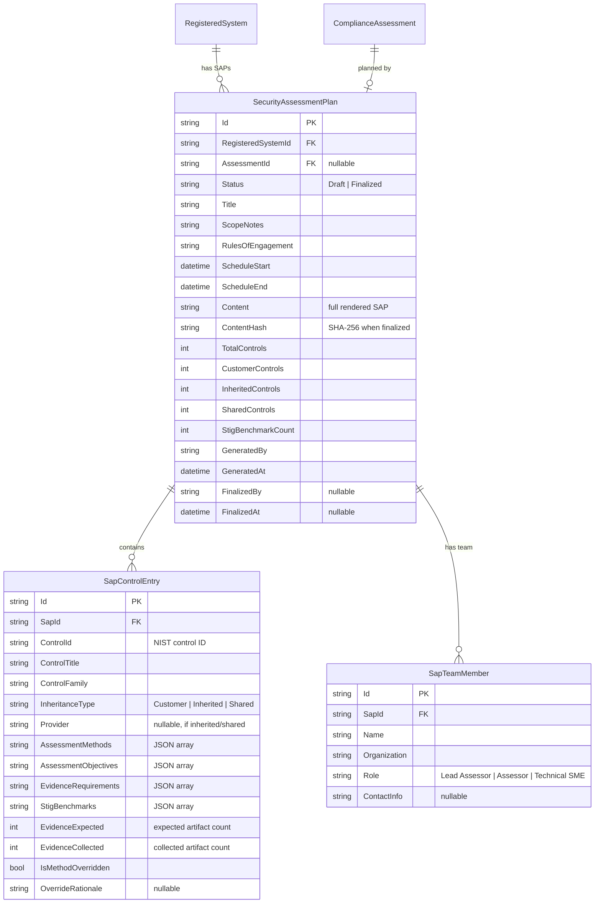

# Feature 018 — Data Model

## Entity Relationship Diagram



---

## New Entities

### `SecurityAssessmentPlan`

| Field | Type | Constraints | Description |
|-------|------|-------------|-------------|
| `Id` | `string` | PK, MaxLength(36) | GUID primary key |
| `RegisteredSystemId` | `string` | FK, Required, MaxLength(36) | FK to `RegisteredSystem` |
| `AssessmentId` | `string?` | FK, MaxLength(36) | Optional FK to `ComplianceAssessment` — links SAP to a specific assessment cycle |
| `Status` | `SapStatus` | Required | `Draft` or `Finalized` |
| `Title` | `string` | Required, MaxLength(500) | SAP document title (e.g., "Security Assessment Plan — ACME System — FY26 Q2") |
| `BaselineLevel` | `string` | Required, MaxLength(20) | Baseline level at time of SAP generation ("Low", "Moderate", "High") |
| `ScopeNotes` | `string?` | MaxLength(4000) | SCA-provided notes on assessment scope, limitations, or special instructions |
| `RulesOfEngagement` | `string?` | MaxLength(4000) | Assessment constraints, availability windows, escalation procedures |
| `ScheduleStart` | `DateTime?` | | Planned assessment start date |
| `ScheduleEnd` | `DateTime?` | | Planned assessment end date |
| `Content` | `string` | Required | Full rendered SAP content (Markdown) |
| `ContentHash` | `string?` | MaxLength(64) | SHA-256 hash of `Content` when finalized — integrity verification |
| `TotalControls` | `int` | | Total controls in assessment scope |
| `CustomerControls` | `int` | | Controls requiring direct assessment |
| `InheritedControls` | `int` | | Controls assessed by provider (attestation review only) |
| `SharedControls` | `int` | | Shared responsibility controls |
| `StigBenchmarkCount` | `int` | | Number of STIG benchmarks in testing plan |
| `GeneratedBy` | `string` | Required, MaxLength(200) | User who generated the SAP |
| `GeneratedAt` | `DateTime` | Required | SAP generation timestamp (UTC) |
| `FinalizedBy` | `string?` | MaxLength(200) | User who finalized the SAP |
| `FinalizedAt` | `DateTime?` | | Finalization timestamp (UTC) |
| `Format` | `string` | Required, MaxLength(20), Default "markdown" | Output format of the SAP |

**Navigation properties:**
- `RegisteredSystem` → `RegisteredSystem`
- `ComplianceAssessment` → `ComplianceAssessment?`
- `ControlEntries` → `ICollection<SapControlEntry>`
- `TeamMembers` → `ICollection<SapTeamMember>`

### `SapControlEntry`

| Field | Type | Constraints | Description |
|-------|------|-------------|-------------|
| `Id` | `string` | PK, MaxLength(36) | GUID primary key |
| `SecurityAssessmentPlanId` | `string` | FK, Required, MaxLength(36) | FK to `SecurityAssessmentPlan` |
| `ControlId` | `string` | Required, MaxLength(20) | NIST 800-53 control ID (e.g., "AC-2") |
| `ControlTitle` | `string` | Required, MaxLength(500) | Control title from OSCAL catalog |
| `ControlFamily` | `string` | Required, MaxLength(100) | Control family name (e.g., "Access Control") |
| `InheritanceType` | `InheritanceType` | Required | `Customer`, `Inherited`, or `Shared` |
| `Provider` | `string?` | MaxLength(200) | CSP or provider name if inherited/shared |
| `AssessmentMethods` | `List<string>` | JSON column | Assessment methods: "Test", "Examine", "Interview" |
| `AssessmentObjectives` | `List<string>` | JSON column | OSCAL-derived assessment objective prose strings |
| `EvidenceRequirements` | `List<string>` | JSON column | Expected evidence artifacts per method |
| `StigBenchmarks` | `List<string>` | JSON column | STIG benchmark IDs covering this control |
| `EvidenceExpected` | `int` | Default 0 | Number of evidence artifacts expected (derived from method count) |
| `EvidenceCollected` | `int` | Default 0 | Number of `ComplianceEvidence` records already collected for this control |
| `IsMethodOverridden` | `bool` | Default false | Whether SCA overrode the default methods |
| `OverrideRationale` | `string?` | MaxLength(2000) | Justification for method override |

**Navigation properties:**
- `SecurityAssessmentPlan` → `SecurityAssessmentPlan`

### `SapTeamMember`

| Field | Type | Constraints | Description |
|-------|------|-------------|-------------|
| `Id` | `string` | PK, MaxLength(36) | GUID primary key |
| `SecurityAssessmentPlanId` | `string` | FK, Required, MaxLength(36) | FK to `SecurityAssessmentPlan` |
| `Name` | `string` | Required, MaxLength(200) | Team member full name |
| `Organization` | `string` | Required, MaxLength(200) | Organization or company name |
| `Role` | `string` | Required, MaxLength(50) | "Lead Assessor", "Assessor", "Technical SME" |
| `ContactInfo` | `string?` | MaxLength(500) | Email, phone, or other contact info |

**Navigation properties:**
- `SecurityAssessmentPlan` → `SecurityAssessmentPlan`

---

## New Enums

```csharp
/// <summary>Status of a Security Assessment Plan.</summary>
public enum SapStatus
{
    /// <summary>SAP is being drafted and can be modified.</summary>
    Draft,

    /// <summary>SAP is locked with SHA-256 integrity hash. No further modifications allowed.</summary>
    Finalized
}
```

---

## EF Core Configuration

### DbContext Additions

```csharp
// In AtoCopilotContext:
public DbSet<SecurityAssessmentPlan> SecurityAssessmentPlans => Set<SecurityAssessmentPlan>();
public DbSet<SapControlEntry> SapControlEntries => Set<SapControlEntry>();
public DbSet<SapTeamMember> SapTeamMembers => Set<SapTeamMember>();
```

### OnModelCreating Configuration

```csharp
// SecurityAssessmentPlan
modelBuilder.Entity<SecurityAssessmentPlan>(e =>
{
    e.HasKey(s => s.Id);
    e.Property(s => s.Status).HasConversion<string>().HasMaxLength(20);
    e.Property(s => s.Format).HasDefaultValue("markdown");
    e.HasOne(s => s.RegisteredSystem)
        .WithMany()
        .HasForeignKey(s => s.RegisteredSystemId)
        .OnDelete(DeleteBehavior.Cascade);
    e.HasOne(s => s.ComplianceAssessment)
        .WithMany()
        .HasForeignKey(s => s.AssessmentId)
        .IsRequired(false)
        .OnDelete(DeleteBehavior.SetNull);
    e.HasIndex(s => new { s.RegisteredSystemId, s.Status });
});

// SapControlEntry
modelBuilder.Entity<SapControlEntry>(e =>
{
    e.HasKey(c => c.Id);
    e.Property(c => c.InheritanceType).HasConversion<string>().HasMaxLength(20);
    e.Property(c => c.AssessmentMethods).HasColumnType("nvarchar(max)")
        .HasConversion(
            v => JsonSerializer.Serialize(v, (JsonSerializerOptions?)null),
            v => JsonSerializer.Deserialize<List<string>>(v, (JsonSerializerOptions?)null) ?? new());
    e.Property(c => c.AssessmentObjectives).HasColumnType("nvarchar(max)")
        .HasConversion(
            v => JsonSerializer.Serialize(v, (JsonSerializerOptions?)null),
            v => JsonSerializer.Deserialize<List<string>>(v, (JsonSerializerOptions?)null) ?? new());
    e.Property(c => c.EvidenceRequirements).HasColumnType("nvarchar(max)")
        .HasConversion(
            v => JsonSerializer.Serialize(v, (JsonSerializerOptions?)null),
            v => JsonSerializer.Deserialize<List<string>>(v, (JsonSerializerOptions?)null) ?? new());
    e.Property(c => c.StigBenchmarks).HasColumnType("nvarchar(max)")
        .HasConversion(
            v => JsonSerializer.Serialize(v, (JsonSerializerOptions?)null),
            v => JsonSerializer.Deserialize<List<string>>(v, (JsonSerializerOptions?)null) ?? new());
    e.HasOne(c => c.SecurityAssessmentPlan)
        .WithMany(s => s.ControlEntries)
        .HasForeignKey(c => c.SecurityAssessmentPlanId)
        .OnDelete(DeleteBehavior.Cascade);
    e.HasIndex(c => new { c.SecurityAssessmentPlanId, c.ControlId }).IsUnique();
});

// SapTeamMember
modelBuilder.Entity<SapTeamMember>(e =>
{
    e.HasKey(t => t.Id);
    e.HasOne(t => t.SecurityAssessmentPlan)
        .WithMany(s => s.TeamMembers)
        .HasForeignKey(t => t.SecurityAssessmentPlanId)
        .OnDelete(DeleteBehavior.Cascade);
});
```

---

## DTOs (Not Persisted)

```csharp
/// <summary>Input for per-control method override when generating or updating a SAP.</summary>
public record SapMethodOverrideInput(
    string ControlId,
    List<string> Methods,
    string? Rationale = null);

/// <summary>Input for assessment team member.</summary>
public record SapTeamMemberInput(
    string Name,
    string Organization,
    string Role,
    string? ContactInfo = null);

/// <summary>Input for SAP generation with optional overrides.</summary>
public record SapGenerationInput(
    string SystemId,
    string? AssessmentId = null,
    DateTime? ScheduleStart = null,
    DateTime? ScheduleEnd = null,
    string? ScopeNotes = null,
    string? RulesOfEngagement = null,
    List<SapTeamMemberInput>? TeamMembers = null,
    List<SapMethodOverrideInput>? MethodOverrides = null,
    string Format = "markdown");

/// <summary>Input for SAP update (draft only).</summary>
public record SapUpdateInput(
    string SapId,
    DateTime? ScheduleStart = null,
    DateTime? ScheduleEnd = null,
    string? ScopeNotes = null,
    string? RulesOfEngagement = null,
    List<SapTeamMemberInput>? TeamMembers = null,
    List<SapMethodOverrideInput>? MethodOverrides = null);

/// <summary>Result of SAP generation or retrieval.</summary>
public class SapDocument
{
    public string SapId { get; set; } = string.Empty;
    public string SystemId { get; set; } = string.Empty;
    public string? AssessmentId { get; set; }
    public string Title { get; set; } = string.Empty;
    public string Status { get; set; } = "Draft";
    public string Format { get; set; } = "markdown";
    public string BaselineLevel { get; set; } = string.Empty;
    public string Content { get; set; } = string.Empty;
    public string? ContentHash { get; set; }
    public int TotalControls { get; set; }
    public int CustomerControls { get; set; }
    public int InheritedControls { get; set; }
    public int SharedControls { get; set; }
    public int StigBenchmarkCount { get; set; }
    public int ControlsWithObjectives { get; set; }
    public int EvidenceGaps { get; set; }
    public List<SapFamilySummary> FamilySummaries { get; set; } = new();
    public DateTime GeneratedAt { get; set; } = DateTime.UtcNow;
    public DateTime? FinalizedAt { get; set; }
}

/// <summary>Per-family summary in SAP.</summary>
public class SapFamilySummary
{
    public string Family { get; set; } = string.Empty;
    public int ControlCount { get; set; }
    public int CustomerCount { get; set; }
    public int InheritedCount { get; set; }
    public List<string> Methods { get; set; } = new();
}

/// <summary>SAP completeness validation result.</summary>
public class SapValidationResult
{
    public bool IsComplete { get; set; }
    public List<string> Warnings { get; set; } = new();
    public int ControlsCovered { get; set; }
    public int ControlsMissingObjectives { get; set; }
    public int ControlsMissingMethods { get; set; }
    public bool HasTeam { get; set; }
    public bool HasSchedule { get; set; }
}
```
