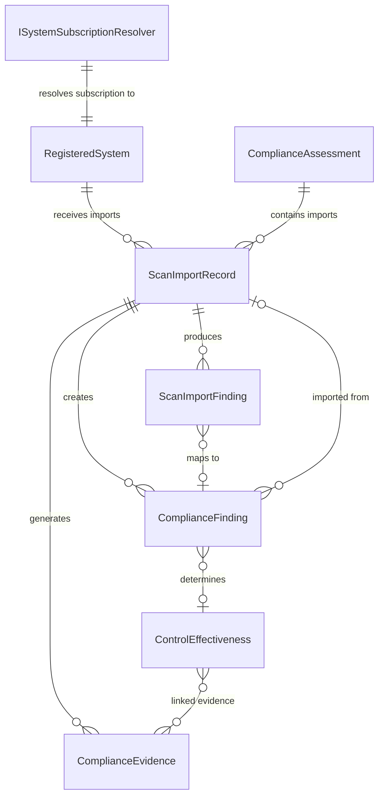

# Data Model: 019 — Prisma Cloud Scan Import

**Date**: 2026-03-05 | **Plan**: [plan.md](plan.md) | **Spec**: [spec.md](spec.md)

## Entity Relationship Diagram

## Enum Extensions

### ScanImportType — [ScanImportModels.cs](../../src/Ato.Copilot.Core/Models/Compliance/ScanImportModels.cs)

| Value | Description | Existing? |
|-------|-------------|-----------|
| `Ckl` | DISA STIG Viewer checklist (.ckl) | ✅ Existing |
| `Xccdf` | SCAP Compliance Checker XCCDF results (.xml) | ✅ Existing |
| `PrismaCsv` | Prisma Cloud CSPM compliance export (CSV) | **NEW** |
| `PrismaApi` | Prisma Cloud API JSON (RQL alert response) | **NEW** |

## Modified Entities

### ScanImportFinding — [ScanImportModels.cs](../../src/Ato.Copilot.Core/Models/Compliance/ScanImportModels.cs)

New nullable fields for Prisma-specific alert metadata. All existing STIG fields remain unchanged.

| Field | Type | Constraints | Description |
|-------|------|-------------|-------------|
| `PrismaAlertId` | `string?` | MaxLength(100) | Prisma alert ID (e.g., `P-12345`). Used as conflict resolution matching key. |
| `PrismaPolicyId` | `string?` | MaxLength(200) | Prisma policy UUID from API JSON. |
| `PrismaPolicyName` | `string?` | MaxLength(500) | Policy display name (e.g., "Azure Storage encryption not enabled"). |
| `CloudResourceId` | `string?` | MaxLength(1000) | Full ARM resource ID for Azure resources. |
| `CloudResourceType` | `string?` | MaxLength(200) | ARM resource type (e.g., `Microsoft.Storage/storageAccounts`). |
| `CloudRegion` | `string?` | MaxLength(100) | Cloud region (e.g., `eastus`, `usgovvirginia`). |
| `CloudAccountId` | `string?` | MaxLength(200) | Azure subscription GUID or AWS account ID. |

**Note**: These fields are nullable because they only apply to Prisma imports. CKL/XCCDF imports leave them null.

### ComplianceFinding — [ComplianceModels.cs](../../src/Ato.Copilot.Core/Models/Compliance/ComplianceModels.cs)

No new fields added. Prisma imports use existing fields with specific values:

| Field | Prisma Value | Notes |
|-------|-------------|-------|
| `StigFinding` | `false` | Not a STIG finding |
| `StigId` | `null` | No STIG ID |
| `ScanSource` | `ScanSourceType.Cloud` | New enum value if not already present, else use existing `Cloud` value |
| `Source` | `"Prisma Cloud"` | Identifies finding origin |
| `ResourceId` | Full ARM resource ID | From Prisma `Resource ID` column or `resource.id` JSON field |
| `ResourceType` | ARM resource type | From Prisma `Resource Type` column or `resource.resourceType` JSON field |
| `Title` | Prisma Policy Name | From `Policy Name` column or `policy.name` JSON field |
| `Description` | Policy description | From API JSON `policy.description` (CSV has no description field) |
| `RemediationGuidance` | Policy recommendation | From API JSON `policy.recommendation` (CSV has no recommendation field) |
| `RemediationScript` | CLI script template | From API JSON `policy.remediation.cliScriptTemplate` |
| `AutoRemediable` | `policy.remediable` flag | From API JSON (always `false` for CSV imports) |
| `ImportRecordId` | FK → `ScanImportRecord` | Links finding to import operation |

### ComplianceEvidence — [ComplianceModels.cs](../../src/Ato.Copilot.Core/Models/Compliance/ComplianceModels.cs)

No new fields added. Prisma imports create evidence with specific values:

| Field | Prisma Value |
|-------|-------------|
| `EvidenceType` | `"CloudScanResult"` |
| `EvidenceCategory` | `Configuration` |
| `CollectionMethod` | `"Automated"` |
| `ContentHash` | SHA-256 of import file content |
| `Description` | `"Prisma Cloud CSPM compliance scan import"` |
| `Content` | Summary JSON with alert counts, NIST controls, subscription info |

## New DTOs

### ParsedPrismaAlert (Phase 1)

Intermediate DTO representing a single consolidated Prisma alert after CSV/JSON parsing.

| Field | Type | Description |
|-------|------|-------------|
| `AlertId` | `string` | Prisma alert ID (grouping key for CSV multi-row alerts) |
| `Status` | `string` | `open`, `resolved`, `dismissed`, `snoozed` |
| `PolicyName` | `string` | Policy display name |
| `PolicyType` | `string` | `config`, `network`, `audit_event`, `anomaly` |
| `Severity` | `string` | `critical`, `high`, `medium`, `low`, `informational` |
| `CloudType` | `string` | `azure`, `aws`, `gcp` |
| `AccountName` | `string` | Cloud account display name |
| `AccountId` | `string` | Azure subscription GUID or AWS/GCP account ID |
| `Region` | `string` | Cloud region |
| `ResourceName` | `string` | Resource display name |
| `ResourceId` | `string` | Full ARM resource ID (Azure) |
| `ResourceType` | `string` | ARM resource type (Azure) |
| `AlertTime` | `DateTime` | When the alert was first triggered (UTC) |
| `ResolutionReason` | `string?` | Reason for resolution/dismissal |
| `ResolutionTime` | `DateTime?` | When resolved/dismissed (UTC) |
| `NistControlIds` | `List<string>` | Extracted NIST 800-53 control IDs (e.g., `["SC-28", "SC-12"]`) |
| `Description` | `string?` | Full policy description (API JSON only) |
| `Recommendation` | `string?` | Remediation guidance (API JSON only) |
| `RemediationScript` | `string?` | CLI script template (API JSON only) |
| `PolicyLabels` | `List<string>` | Policy classification tags (API JSON only) |
| `Remediable` | `bool` | Whether auto-remediation is possible (API JSON only, default false for CSV) |
| `AlertHistory` | `List<PrismaAlertHistoryEntry>?` | State change history (API JSON only) |

### PrismaAlertHistoryEntry (Setup — used in API JSON Import)

Alert state change history entry from API JSON `history[]` array.

| Field | Type | Description |
|-------|------|-------------|
| `ModifiedBy` | `string` | Who made the change (e.g., "System", user email) |
| `ModifiedOn` | `DateTime` | When the change occurred (UTC, converted from Unix epoch ms) |
| `Reason` | `string` | Change reason (e.g., "NEW_ALERT", "RESOURCE_UPDATED", "DISMISSED") |
| `Status` | `string` | Alert status after change (`open`, `resolved`, `dismissed`) |

### ParsedPrismaFile (Phase 1)

Container DTO for a fully parsed Prisma import file.

| Field | Type | Description |
|-------|------|-------------|
| `SourceType` | `ScanImportType` | `PrismaCsv` or `PrismaApi` |
| `Alerts` | `List<ParsedPrismaAlert>` | All parsed alerts (grouped by Alert ID for CSV) |
| `TotalAlerts` | `int` | Total alert count |
| `TotalRows` | `int` | Total CSV rows or JSON objects before grouping |
| `AccountIds` | `List<string>` | Unique cloud account IDs found in the file |

### PrismaTrendResult (Phase 3)

Trend analysis output comparing findings across scan imports.

| Field | Type | Description |
|-------|------|-------------|
| `SystemId` | `string` | RegisteredSystem ID |
| `Imports` | `List<PrismaTrendImport>` | Import snapshots with date and counts |
| `NewFindings` | `int` | Findings in latest import not in any previous |
| `ResolvedFindings` | `int` | Findings in previous imports now resolved/missing |
| `PersistentFindings` | `int` | Findings present in both latest and previous imports |
| `RemediationRate` | `decimal` | Percentage of resolved findings (resolved / (resolved + persistent)) |
| `ResourceTypeBreakdown` | `Dictionary<string, int>?` | Finding count by ARM resource type (optional, via `group_by`) |
| `NistControlBreakdown` | `Dictionary<string, int>?` | Finding count by NIST control ID (optional, via `group_by`) |

### PrismaTrendImport (Phase 3)

Individual import snapshot within a trend analysis.

| Field | Type | Description |
|-------|------|-------------|
| `ImportId` | `string` | ScanImportRecord ID |
| `ImportedAt` | `DateTime` | When the import was performed |
| `FileName` | `string` | Original file name |
| `TotalAlerts` | `int` | Total alerts in this import |
| `OpenCount` | `int` | Open findings |
| `ResolvedCount` | `int` | Resolved findings |
| `DismissedCount` | `int` | Dismissed findings |

## Severity Mapping

| Prisma Severity | `CatSeverity` | `FindingSeverity` | ControlEffectiveness Impact |
|-----------------|---------------|-------------------|-----------------------------|
| `critical` | `CatI` | `Critical` | `OtherThanSatisfied` if open |
| `high` | `CatI` | `High` | `OtherThanSatisfied` if open |
| `medium` | `CatII` | `Medium` | `OtherThanSatisfied` if open |
| `low` | `CatIII` | `Low` | `OtherThanSatisfied` if open |
| `informational` | *(none)* | `Informational` | No effectiveness impact |

## Status Mapping

| Prisma Status | `FindingStatus` | Effectiveness Behavior |
|---------------|-----------------|----------------------|
| `open` | `Open` | Contributes `OtherThanSatisfied` to aggregate |
| `resolved` | `Remediated` | Closes finding. Re-evaluate aggregate — if ALL findings for the control are `Remediated`/`Accepted`, control becomes `Satisfied`. |
| `dismissed` | `Accepted` | Closes finding. Same aggregate re-evaluation. |
| `snoozed` | `Open` | Treated as open (snoozed is temporary suppression). Note appended: CSV → "Snoozed (snooze expiry unavailable from CSV)"; API JSON → "Snoozed until {date}" if expiry available in `history[]`. |

## Conflict Resolution Keys

| Import Type | Matching Key | Notes |
|-------------|-------------|-------|
| CKL (Feature 017) | `StigId` + `AssessmentId` | One finding per STIG rule |
| XCCDF (Feature 017) | `StigId` + `AssessmentId` | One finding per STIG rule |
| Prisma CSV (Feature 019) | `PrismaAlertId` + `RegisteredSystemId` | One finding per Prisma alert |
| Prisma API (Feature 019) | `PrismaAlertId` + `RegisteredSystemId` | One finding per Prisma alert |

## Index Strategy

No new database indexes required. Prisma fields are nullable on `ScanImportFinding` and are filtered in-memory after loading by `ScanImportRecordId`. The `PrismaAlertId` conflict resolution check queries `ComplianceFinding` by `AssessmentId` + `Source == "Prisma Cloud"`, which uses the existing `AssessmentId` index.
