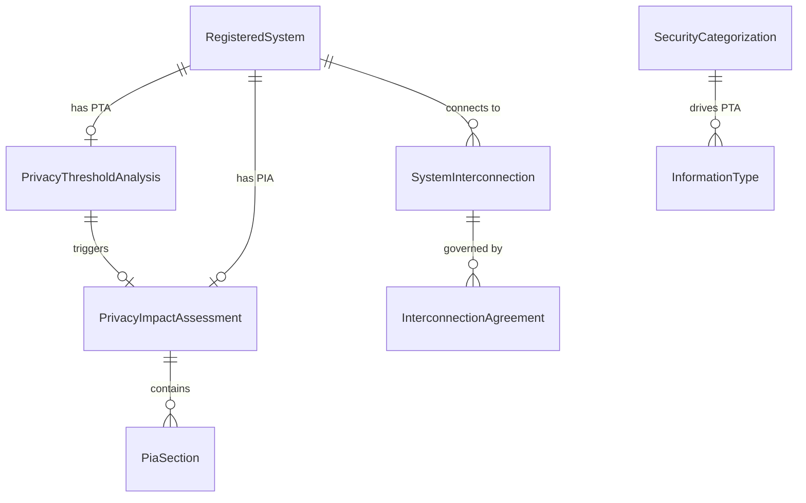

# Data Model: 021 — PIA Service + System Interconnections

**Date**: 2026-03-07 | **Plan**: [plan.md](plan.md) | **Spec**: [spec.md](spec.md)

## Entity Relationship Diagram



## New Entities

### PrivacyThresholdAnalysis (Phase 1)

Determines whether a system requires a full Privacy Impact Assessment. One per system.

| Field | Type | Constraints | Description |
|-------|------|-------------|-------------|
| `Id` | `string` | PK, GUID | Unique identifier |
| `RegisteredSystemId` | `string` | FK → RegisteredSystem, Required, Unique | System this PTA belongs to |
| `Determination` | `PtaDetermination` enum | Required | `PiaRequired` \| `PiaNotRequired` \| `Exempt` \| `PendingConfirmation` |
| `CollectsPii` | `bool` | Required | Whether the system collects PII |
| `MaintainsPii` | `bool` | Required | Whether the system stores/maintains PII |
| `DisseminatesPii` | `bool` | Required | Whether the system shares PII with external parties |
| `PiiCategories` | `List<string>` | JSON column | PII categories identified (e.g., "SSN", "Medical Records", "Financial Data") |
| `AffectedIndividuals` | `string?` | MaxLength(200) | Population affected (e.g., "Federal employees", "General public") |
| `EstimatedRecordCount` | `int?` | | Estimated number of PII records (≥10 triggers PIA per E-Gov Act) |
| `PiiSourceInfoTypes` | `List<string>` | JSON column | SP 800-60 info type IDs that contain PII (auto-detected from SecurityCategorization) |
| `ExemptionRationale` | `string?` | MaxLength(2000) | Required if Determination = Exempt (e.g., government-to-government, national security) |
| `Rationale` | `string?` | MaxLength(4000) | AI-generated or user-provided justification for the determination |
| `AnalyzedBy` | `string` | Required, MaxLength(200) | User who conducted the PTA |
| `AnalyzedAt` | `DateTime` | UTC | When the PTA was completed |

**Unique constraint**: One PTA per `RegisteredSystemId`.

### PrivacyImpactAssessment (Phase 1)

Full PIA document with lifecycle management. One per system (when PTA determines PIA is required).

| Field | Type | Constraints | Description |
|-------|------|-------------|-------------|
| `Id` | `string` | PK, GUID | Unique identifier |
| `RegisteredSystemId` | `string` | FK → RegisteredSystem, Required, Unique | System this PIA belongs to |
| `PtaId` | `string` | FK → PrivacyThresholdAnalysis, Required | Triggering PTA |
| `Status` | `PiaStatus` enum | Required | `Draft` \| `UnderReview` \| `Approved` \| `Expired` |
| `Version` | `int` | Required, Default: 1 | Document version (incremented on resubmission after revision) |
| `SystemDescription` | `string?` | MaxLength(4000) | Pre-populated from RegisteredSystem.Description |
| `PurposeOfCollection` | `string?` | MaxLength(4000) | Why PII is collected |
| `IntendedUse` | `string?` | MaxLength(4000) | How PII is used |
| `SharingPartners` | `List<string>` | JSON column | External parties PII is shared with |
| `NoticeAndConsent` | `string?` | MaxLength(4000) | How individuals are notified and consent is obtained |
| `IndividualAccess` | `string?` | MaxLength(4000) | How individuals can access/correct their records |
| `Safeguards` | `string?` | MaxLength(4000) | Security measures protecting PII (pre-populated from control baseline) |
| `RetentionPeriod` | `string?` | MaxLength(500) | How long PII is retained |
| `DisposalMethod` | `string?` | MaxLength(500) | How PII is disposed/destroyed |
| `SornRequired` | `bool?` | | Whether a System of Records Notice is required |
| `SornReference` | `string?` | MaxLength(200) | Federal Register citation if SORN exists |
| `NarrativeDocument` | `string?` | MaxLength(16000) | Full PIA narrative (markdown format) |
| `ReviewerComments` | `string?` | MaxLength(4000) | Reviewer notes (populated on review) |
| `ReviewDeficiencies` | `List<string>` | JSON column | Specific deficiencies if revision requested |
| `ApprovedBy` | `string?` | MaxLength(200) | Reviewer who approved the PIA |
| `ApprovedAt` | `DateTime?` | UTC | Approval timestamp |
| `ExpirationDate` | `DateTime?` | UTC | Approval + 1 year (annual review requirement) |
| `CreatedBy` | `string` | Required, MaxLength(200) | User who initiated the PIA |
| `CreatedAt` | `DateTime` | UTC | Creation timestamp |
| `ModifiedAt` | `DateTime?` | UTC | Last modification |
| `Sections` | `List<PiaSection>` | JSON column | PIA questionnaire sections with question-answer pairs |

**Unique constraint**: One PIA per `RegisteredSystemId`.

### PiaSection (Phase 1)

Individual PIA questionnaire section with question-answer pairs. Owned entity stored via JSON column on `PrivacyImpactAssessment`.

| Field | Type | Constraints | Description |
|-------|------|-------------|-------------|
| `SectionId` | `string` | Required, MaxLength(10) | Section identifier (e.g., "1.1", "2.3") |
| `Title` | `string` | Required, MaxLength(200) | Section title per OMB M-03-22 |
| `Question` | `string` | Required, MaxLength(1000) | Questionnaire question |
| `Answer` | `string?` | MaxLength(4000) | User or AI-drafted response |
| `IsPrePopulated` | `bool` | Default: false | Whether the answer was auto-filled from system data |
| `SourceField` | `string?` | MaxLength(200) | Source entity/field if pre-populated |

**Storage**: JSON column on `PrivacyImpactAssessment` (not a separate table).

### SystemInterconnection (Phase 2)

Tracks an external system-to-system data flow that crosses the authorization boundary.

| Field | Type | Constraints | Description |
|-------|------|-------------|-------------|
| `Id` | `string` | PK, GUID | Unique identifier |
| `RegisteredSystemId` | `string` | FK → RegisteredSystem, Required | Source system (our system) |
| `TargetSystemName` | `string` | Required, MaxLength(200) | Name of external system |
| `TargetSystemOwner` | `string?` | MaxLength(200) | Organization/POC owning target system |
| `TargetSystemAcronym` | `string?` | MaxLength(20) | Target system abbreviation |
| `InterconnectionType` | `InterconnectionType` enum | Required | `Direct` \| `Vpn` \| `Api` \| `Federated` \| `Wireless` \| `RemoteAccess` |
| `DataFlowDirection` | `DataFlowDirection` enum | Required | `Inbound` \| `Outbound` \| `Bidirectional` |
| `DataClassification` | `string` | Required, MaxLength(50) | `Unclassified` \| `CUI` \| `Secret` \| `TopSecret` |
| `DataDescription` | `string?` | MaxLength(2000) | Description of data exchanged |
| `ProtocolsUsed` | `List<string>` | JSON column | Protocols (e.g., "TLS 1.3", "IPSec", "SFTP", "REST/HTTPS") |
| `PortsUsed` | `List<string>` | JSON column | Ports (e.g., "443", "22", "8443") |
| `SecurityMeasures` | `List<string>` | JSON column | Security controls (e.g., "AES-256 encryption", "Mutual TLS", "MFA") |
| `AuthenticationMethod` | `string?` | MaxLength(200) | How systems authenticate to each other |
| `Status` | `InterconnectionStatus` enum | Required | `Proposed` \| `Active` \| `Suspended` \| `Terminated` |
| `StatusReason` | `string?` | MaxLength(1000) | Reason for suspension/termination |
| `AuthorizationToConnect` | `bool` | Default: false | Whether connection has been formally authorized |
| `CreatedBy` | `string` | Required, MaxLength(200) | User who registered the interconnection |
| `CreatedAt` | `DateTime` | UTC | Registration timestamp |
| `ModifiedAt` | `DateTime?` | UTC | Last modification |
| `Agreements` | `List<InterconnectionAgreement>` | Navigation | Agreements governing this interconnection |

### InterconnectionAgreement (Phase 3)

Tracks ISA, MOU, or SLA agreements governing system interconnections.

| Field | Type | Constraints | Description |
|-------|------|-------------|-------------|
| `Id` | `string` | PK, GUID | Unique identifier |
| `SystemInterconnectionId` | `string` | FK → SystemInterconnection, Required | Parent interconnection |
| `AgreementType` | `AgreementType` enum | Required | `Isa` \| `Mou` \| `Sla` |
| `Title` | `string` | Required, MaxLength(500) | Agreement title |
| `DocumentReference` | `string?` | MaxLength(1000) | URL or path to agreement document |
| `Status` | `AgreementStatus` enum | Required | `Draft` \| `PendingSignature` \| `Signed` \| `Expired` \| `Terminated` |
| `EffectiveDate` | `DateTime?` | UTC | When agreement becomes effective |
| `ExpirationDate` | `DateTime?` | UTC | When agreement expires |
| `SignedByLocal` | `string?` | MaxLength(200) | Local signatory name/title |
| `SignedByLocalDate` | `DateTime?` | UTC | Local signature date |
| `SignedByRemote` | `string?` | MaxLength(200) | Remote/partner signatory name/title |
| `SignedByRemoteDate` | `DateTime?` | UTC | Remote signature date |
| `ReviewNotes` | `string?` | MaxLength(4000) | Review or renewal notes |
| `NarrativeDocument` | `string?` | MaxLength(16000) | AI-generated ISA/MOU template (markdown) |
| `CreatedBy` | `string` | Required, MaxLength(200) | User who registered the agreement |
| `CreatedAt` | `DateTime` | UTC | Registration timestamp |
| `ModifiedAt` | `DateTime?` | UTC | Last modification |

## Modified Entities

### RegisteredSystem — [RmfModels.cs](../../src/Ato.Copilot.Core/Models/Compliance/RmfModels.cs)

| Field | Change | Details |
|-------|--------|---------|
| `PrivacyThresholdAnalysis` | **ADD** | Navigation property. `RegisteredSystem` has zero-or-one `PrivacyThresholdAnalysis`. |
| `PrivacyImpactAssessment` | **ADD** | Navigation property. `RegisteredSystem` has zero-or-one `PrivacyImpactAssessment`. |
| `SystemInterconnections` | **ADD** | Navigation collection. `RegisteredSystem` has zero-or-many `SystemInterconnection`. |
| `HasNoExternalInterconnections` | **ADD** | `bool`, default `false`. Set to `true` to certify system has no interconnections (satisfies Gate 4 without interconnection records). |

## New Enums

```csharp
/// <summary>
/// Privacy Threshold Analysis determination outcome.
/// </summary>
public enum PtaDetermination
{
    /// <summary>System collects/maintains/disseminates PII — full PIA required.</summary>
    PiaRequired,
    /// <summary>System does not process PII — PIA not required.</summary>
    PiaNotRequired,
    /// <summary>System is exempt from PIA requirement (e.g., national security, government-to-government).</summary>
    Exempt,
    /// <summary>Ambiguous PII info types flagged — awaiting human confirmation before final determination.</summary>
    PendingConfirmation
}

/// <summary>
/// PIA lifecycle status.
/// </summary>
public enum PiaStatus
{
    /// <summary>PIA is being drafted.</summary>
    Draft,
    /// <summary>PIA submitted for ISSM review.</summary>
    UnderReview,
    /// <summary>PIA approved by ISSM/Privacy Officer.</summary>
    Approved,
    /// <summary>PIA approval has expired (annual review overdue).</summary>
    Expired
}

/// <summary>
/// PIA reviewer decision.
/// </summary>
public enum PiaReviewDecision
{
    /// <summary>PIA meets all requirements — approved.</summary>
    Approved,
    /// <summary>PIA has deficiencies — returned to ISSO for revision.</summary>
    RequestRevision
}

/// <summary>
/// System interconnection type per NIST SP 800-47.
/// </summary>
public enum InterconnectionType
{
    /// <summary>Direct network connection.</summary>
    Direct,
    /// <summary>Virtual Private Network connection.</summary>
    Vpn,
    /// <summary>Application Programming Interface (REST, SOAP, GraphQL).</summary>
    Api,
    /// <summary>Federated identity or authentication connection.</summary>
    Federated,
    /// <summary>Wireless interconnection.</summary>
    Wireless,
    /// <summary>Remote access connection (VDI, Citrix, RDP).</summary>
    RemoteAccess
}

/// <summary>
/// Direction of data flow in an interconnection.
/// </summary>
public enum DataFlowDirection
{
    /// <summary>Data flows into this system from the target.</summary>
    Inbound,
    /// <summary>Data flows out of this system to the target.</summary>
    Outbound,
    /// <summary>Data flows in both directions.</summary>
    Bidirectional
}

/// <summary>
/// Lifecycle status of a system interconnection.
/// </summary>
public enum InterconnectionStatus
{
    /// <summary>Interconnection planned but not yet active.</summary>
    Proposed,
    /// <summary>Interconnection is active and operational.</summary>
    Active,
    /// <summary>Interconnection temporarily suspended.</summary>
    Suspended,
    /// <summary>Interconnection permanently terminated (retained for audit).</summary>
    Terminated
}

/// <summary>
/// Classification of interconnection agreement.
/// </summary>
public enum AgreementType
{
    /// <summary>Interconnection Security Agreement — technical security terms.</summary>
    Isa,
    /// <summary>Memorandum of Understanding — organizational responsibilities.</summary>
    Mou,
    /// <summary>Service Level Agreement — performance and availability terms.</summary>
    Sla
}

/// <summary>
/// Lifecycle status of an interconnection agreement.
/// </summary>
public enum AgreementStatus
{
    /// <summary>Agreement is being drafted.</summary>
    Draft,
    /// <summary>Agreement drafted, awaiting signatures.</summary>
    PendingSignature,
    /// <summary>Agreement signed by all parties — active.</summary>
    Signed,
    /// <summary>Agreement has passed its expiration date.</summary>
    Expired,
    /// <summary>Agreement terminated before expiration.</summary>
    Terminated
}
```

## EF Core Configuration

### New DbSets

```csharp
public DbSet<PrivacyThresholdAnalysis> PrivacyThresholdAnalyses { get; set; } = null!;
public DbSet<PrivacyImpactAssessment> PrivacyImpactAssessments { get; set; } = null!;
public DbSet<SystemInterconnection> SystemInterconnections { get; set; } = null!;
public DbSet<InterconnectionAgreement> InterconnectionAgreements { get; set; } = null!;
```

### Relationships & Indexes

```csharp
// PrivacyThresholdAnalysis — one per system
modelBuilder.Entity<PrivacyThresholdAnalysis>(entity =>
{
    entity.HasOne<RegisteredSystem>()
          .WithOne(s => s.PrivacyThresholdAnalysis)
          .HasForeignKey<PrivacyThresholdAnalysis>(p => p.RegisteredSystemId)
          .OnDelete(DeleteBehavior.Cascade);

    entity.HasIndex(p => p.RegisteredSystemId).IsUnique();

    entity.Property(p => p.PiiCategories)
          .HasConversion(JsonColumnConverter<List<string>>());

    entity.Property(p => p.PiiSourceInfoTypes)
          .HasConversion(JsonColumnConverter<List<string>>());
});

// PrivacyImpactAssessment — one per system, linked to PTA
modelBuilder.Entity<PrivacyImpactAssessment>(entity =>
{
    entity.HasOne<RegisteredSystem>()
          .WithOne(s => s.PrivacyImpactAssessment)
          .HasForeignKey<PrivacyImpactAssessment>(p => p.RegisteredSystemId)
          .OnDelete(DeleteBehavior.Cascade);

    entity.HasOne<PrivacyThresholdAnalysis>()
          .WithOne()
          .HasForeignKey<PrivacyImpactAssessment>(p => p.PtaId)
          .OnDelete(DeleteBehavior.NoAction);

    entity.HasIndex(p => p.RegisteredSystemId).IsUnique();
    entity.HasIndex(p => p.Status);

    entity.Property(p => p.SharingPartners)
          .HasConversion(JsonColumnConverter<List<string>>());

    entity.Property(p => p.ReviewDeficiencies)
          .HasConversion(JsonColumnConverter<List<string>>());

    // PiaSection stored as JSON-owned collection
    entity.Property(p => p.Sections)
          .HasConversion(JsonColumnConverter<List<PiaSection>>());
});

// SystemInterconnection — many per system
modelBuilder.Entity<SystemInterconnection>(entity =>
{
    entity.HasOne<RegisteredSystem>()
          .WithMany(s => s.SystemInterconnections)
          .HasForeignKey(i => i.RegisteredSystemId)
          .OnDelete(DeleteBehavior.Cascade);

    entity.HasIndex(i => new { i.RegisteredSystemId, i.Status });
    entity.HasIndex(i => i.TargetSystemName);

    entity.Property(i => i.ProtocolsUsed)
          .HasConversion(JsonColumnConverter<List<string>>());

    entity.Property(i => i.PortsUsed)
          .HasConversion(JsonColumnConverter<List<string>>());

    entity.Property(i => i.SecurityMeasures)
          .HasConversion(JsonColumnConverter<List<string>>());
});

// InterconnectionAgreement — many per interconnection
modelBuilder.Entity<InterconnectionAgreement>(entity =>
{
    entity.HasOne<SystemInterconnection>()
          .WithMany(i => i.Agreements)
          .HasForeignKey(a => a.SystemInterconnectionId)
          .OnDelete(DeleteBehavior.Cascade);

    entity.HasIndex(a => a.Status);
    entity.HasIndex(a => a.ExpirationDate);
});
```

## DTOs (Non-Persisted)

```csharp
/// <summary>
/// PTA analysis result returned by PrivacyService.
/// </summary>
public record PtaResult(
    string PtaId,
    PtaDetermination Determination,
    bool CollectsPii,
    bool MaintainsPii,
    bool DisseminatesPii,
    List<string> PiiCategories,
    List<string> PiiSourceInfoTypes,
    string Rationale);

/// <summary>
/// PIA generation result with document content.
/// </summary>
public record PiaResult(
    string PiaId,
    PiaStatus Status,
    int Version,
    string NarrativeDocument,
    List<PiaSection> Sections,
    int PrePopulatedSections,
    int TotalSections);

/// <summary>
/// PIA review result.
/// </summary>
public record PiaReviewResult(
    string PiaId,
    PiaReviewDecision Decision,
    PiaStatus NewStatus,
    string ReviewerComments,
    List<string> Deficiencies,
    DateTime? ExpirationDate);

/// <summary>
/// Interconnection registration result.
/// </summary>
public record InterconnectionResult(
    string InterconnectionId,
    string TargetSystemName,
    InterconnectionStatus Status,
    bool HasAgreement);

/// <summary>
/// ISA/MOU generation result.
/// </summary>
public record IsaGenerationResult(
    string AgreementId,
    string Title,
    AgreementType AgreementType,
    string NarrativeDocument);

/// <summary>
/// Agreement validation result.
/// </summary>
public record AgreementValidationResult(
    int TotalInterconnections,
    int CompliantCount,
    int ExpiringWithin90DaysCount,
    int MissingAgreementCount,
    int ExpiredAgreementCount,
    bool IsFullyCompliant,
    List<AgreementValidationItem> Items);

/// <summary>
/// Per-interconnection agreement validation detail.
/// </summary>
public record AgreementValidationItem(
    string InterconnectionId,
    string TargetSystemName,
    string ValidationStatus,  // "Compliant", "ExpiringSoon", "Missing", "Expired"
    string? AgreementTitle,
    DateTime? ExpirationDate,
    string? Notes);

/// <summary>
/// Privacy compliance dashboard result.
/// </summary>
public record PrivacyComplianceResult(
    string SystemId,
    string SystemName,
    PtaDetermination? PtaDetermination,
    PiaStatus? PiaStatus,
    bool PrivacyGateSatisfied,
    int ActiveInterconnections,
    int InterconnectionsWithAgreements,
    int ExpiredAgreements,
    int ExpiringWithin90Days,
    bool InterconnectionGateSatisfied,
    bool HasNoExternalInterconnections,
    string OverallStatus);  // "Compliant", "ActionRequired", "NotStarted"
```
